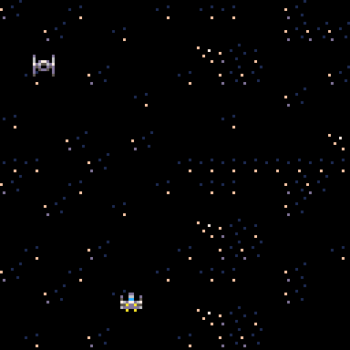

I’m back! Today’s post is going to focus on how I implemented the ability to shoot lasers and the VERY basic AI (I’m not sure you could even call it that right now, it only moves sideways lol). Let’s get right into it!

So, to begin, I made two new variables in my variable page in Pico like,

```
lasers = {}
 lastimer = 0
```

Because Pico uses lua, making objects like you do in a typical OOP is a little different. You basically have to make a collection and give the object its attributes in the collection. The lasers array is going to hold all the lasers that are currently on screen, and the lastimer variable is used to create a delay between firing two different lasers. In order to draw the lasers, I created a few methods in the draw page

```
--function for drawing lasers
 function laserdraw(o)
  spr(o.spr,o.x,o.y)
 end

 --moves bullets a little bit at a time
 function laserupdate(b)
   b.x += b.dx --x moves by dx every frame
   b.y -= b.dy --y moves by dy every frame
   b.time -= 1 --if the laser has exsited for too long, delete it
   return b.time > 0 --returns true if still alive
 end

 --creates a new laser
 function newlaser(x,y,w,h,dx,dy)
   local b = { --only use b in this function
    x=x,y=y,dx=dx,dy=dy,
   w=w,h=j,
   time=60, --how long a bullet will last
   update=laserupdate, --putting function in table
   spr=4,draw=laserdraw
  }
  add(lasers,b)
  return b --if a laser is special we can adjust it
 end
```

I also updated my draw function to include the line

``` for o in all(lasers) do o:draw() end ```

Which basically draws each laser that’s in the laser array.
Lastly, I added a function, a while loop, and some conditional statements to the update page. In the _update() function, I added this to create the delay effect between firing a lot of lasers at a time.

```
if lastimer > 0 then
  lastimer -= 1
 else
  lastimer = 0
 end
```

I also added the line

``` if btn(❎) then createlas() end ```

To make the ship “shoot” a laser if the x key is pressed. In order to update the laser’s position, I added this in the _draw() function as well

```
local i,j=1,1 --properly support deleting items
 while(lasers[i]) do
   if lasers[i]:update() then
    if(i!=j) lasers[j]=lasers[i] lasers[i]=nil --shifts object if necessary
    j+=1
   else lasers[i]=nil end --remove lasers that have died or timed out
    i+=1 --go to the next object
  end
```

This block of code updates the laser’s position every other frame. I added two new functions outside the _draw() function. The first one is

```
function starttimer()
   lastimer = 30
 end
```

This one is pretty self explanatory, it starts the delay timer when it is invoked. The next method is used to create a laser after the button is pressed.

```
function createlas()
  if lastimer == 0 then
   newlaser(p.x,p.y,4,4,0,2)
   starttimer()
  end
 end
```

And that’s all! If you press x you should see a laser shoot out of the ship

