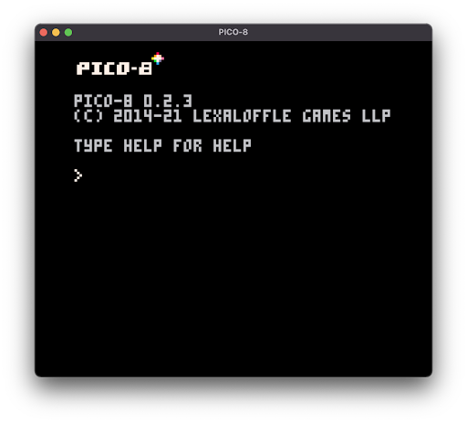
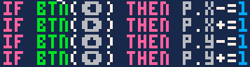
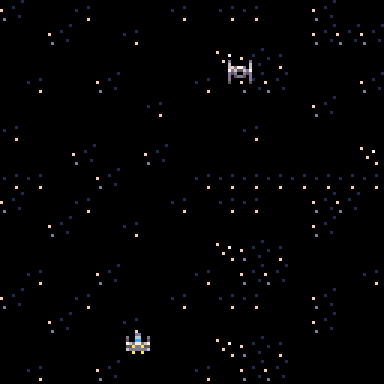

Hey! Welcome to my new blog! This idea was inspired by the fact that I wanted to make my own little slice of the internet.This first blog post is going to focus on the Pico-8 game I’ve been making on and off for the past couple of weeks. I wanted to show you guys some of the findings, challenges, and ideas that I’ve seen while working on this Pico game! Let’s dive in!

I want to start this by explaining what the Pico-8 game engine is. Pico defines itself as a “fantasy console for making, sharing, and playing tiny games and other computer programs.” What is a fantasy console? Good question! A fantasy console is basically a console that never existed. There’s no actual hardware! Pico provides everything you need to make a game with some special limitations that makes game development on Pico super fun!

This is what you get when you load up Pico-8

I decided to make a simple game to get some experience with this console because I thought the concept was super cool! My game (right now) is called SWars. It's… inspired by the popular movie series Star Wars, I’m sure you’ve heard of it before.

The first challenge I had was getting the sprite to move. Luckily, Pico makes this super easy. I made an x and y variable for the player an added some If statements to handle button presses

One of the cool things about Pico is that it proves these buttons that you can get by pressing the shift key and a letter on the keyboard.

Then, in the _draw() function I updated the sprites position.

We have movement!

I’m going to end this post here, expect info on the shooting mechanics and the AI movement on the next post!